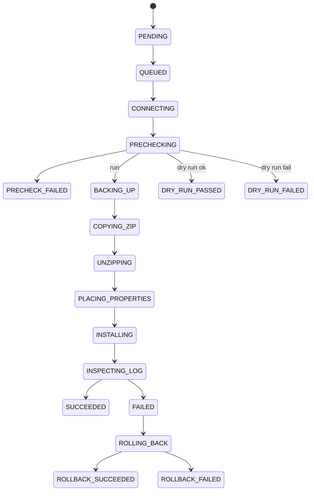

# ORPOS Internal Windows Deployment Platform — Product & Technical Design

> Cursor-ready design package for an internal IT deployment dashboard that deploys Oracle Retail POS (ORPOS) installers to store register Windows machines via PowerShell Remoting / WinRM.
>
> **Scope of this document:** product requirements, user stories, state model, schema, APIs, backend architecture, PowerShell worker workflow, UX specs, phasing, and recommended stack. **No application code in this document.**

---

## 1. PRD

### 1.1 Problem

IT currently deploys ORPOS client updates across store registers by manual remote sessions, ad-hoc scripts, and tribal knowledge. There is no single inventory of machines, no consistent precheck/backup/rollback path, no durable job history, and no safe parallel bulk execution with throttle control.

### 1.2 Goal

Ship an internal web application that lets authorized IT operators:

1. Inventory Windows register machines by store / register group / register id.
2. Create deployment jobs (dry run, run now, or scheduled) against one or many machines.
3. Execute a fixed, audited install workflow over WinRM with backup + log-validated success + automatic rollback.
4. Observe progress, logs, and outcomes from a dashboard and job detail views.
5. Configure grouping rules, paths, throttle, scheduling, and log parsing without code changes.

### 1.3 Non-goals (MVP)

- Public/internet exposure, SSO marketplace packaging, or multi-tenant SaaS.
- Approval / change-management workflow (explicitly out of scope).
- Automatic discovery of machines via AD (optional later; MVP seeds inventory).
- Agent installed on every register (MVP is pure remoting from a central server).
- Patching OS or non-ORPOS software.
- Real-time interactive remote desktop from the UI.

### 1.4 Users & access

| Persona | Access |
|---|---|
| Deployment Operator | Create jobs, run/schedule, retry failed, view logs |
| IT Admin | All operator actions + Settings + inventory CRUD |
| Read-only Auditor | Dashboard, inventory, job detail, logs (no mutate) |

MVP auth: local app users (username/password + role) behind internal network. Phase 2: Windows Auth / AD / Entra ID.

### 1.5 Core business rules (confirmed)

**Hostname convention**

```
<StoreCode>POS<registerid>
```

`StoreCode` is the **3-letter** store code from the store master list (mapped from numeric store id).  
Hostnames are always stored and displayed in **UPPERCASE**.

Examples: `APPPOS001` (store 100), `FDLPOS150` (store 200), `OSHPOS801` (store 1700)

**Default register grouping (configurable in Settings)**

Sourced from ORPOS `application.xml` `RegisterGroups` (`RegisterG1`–`RegisterG14`):

| Parameter | Register ID range | Group name |
|---|---|---|
| RegisterG1 | 001–050 | RegisterG1 |
| RegisterG2 | 100–109 | RegisterG2 |
| RegisterG3 | 110–115 | RegisterG3 |
| RegisterG4 | 150–159 | RegisterG4 |
| RegisterG5 | 260–269 | RegisterG5 |
| RegisterG6 | 360–369 | RegisterG6 |
| RegisterG7 | 470–479 | RegisterG7 |
| RegisterG8 | 570–579 | RegisterG8 |
| RegisterG9 | 680–689 | RegisterG9 |
| RegisterG10 | 790–795 | RegisterG10 |
| RegisterG11 | 830–839 | RegisterG11 |
| RegisterG12 | 930–939 | RegisterG12 |
| RegisterG13 | 801–829 | SCO Register |
| RegisterG14 | 796–800 | Attendant Station |

**Protected install path**

```
C:\OracleRetailStore\CLIENT
```

**Backup naming**

```
C:\OracleRetailStore\CLIENT_<DATE>
```

`<DATE>` format is configurable; recommended default `yyyyMMdd_HHmmss` (local server or target machine local time — store which was used).

**Install sequence (per machine)**

1. Establish WinRM session
2. Prechecks
3. Rename `CLIENT` → `CLIENT_<DATE>`
4. Copy installer ZIP to remote copy path
5. Unzip to remote extract path
6. Copy `ant.installer.properties` into root of unzipped installer
7. Run `install.cmd silent`
8. Inspect ORPOS deployment log for success pattern
9. On failure: rename backup folder back to `CLIENT`
10. Persist full logs, timestamps, statuses, rollback result

**Success validation**

- Exit code alone is insufficient.
- Must parse deployment log matching pattern:
  - Directory/file pattern: `ORPOS-13.4.9\pos-install-<DATE>log` (release folder name and date token configurable via Settings log rules)
- Parsed verdict drives final SUCCESS / FAILED (+ rollback outcomes).

**Execution modes**

- Dry run — run prechecks (and optionally simulated step plan) without mutating install path or running installer
- Run now — immediate execution
- Scheduled — persist schedule and enqueue at fire time

**Concurrency**

- Bulk parallel with configurable throttle (recommended UI range **5–20**; hard floor 1, hard ceiling configurable, default 10)
- One machine failure must not cancel remaining targets in the same job

### 1.6 Required deployment inputs (per job)

| Input | Notes |
|---|---|
| Release number | Free text / semver-like string, e.g. `13.4.9` |
| Installer network path | Always a ZIP; UNC or server-local path visible to worker |
| `ant.installer.properties` source path | Copied into extracted installer root |
| Remote copy path | Destination for ZIP on target |
| Remote unzip/extract path | Destination for extracted files |
| Current install path | Default `C:\OracleRetailStore\CLIENT` |
| Backup naming rule | Preview derived from rule + date |
| Execution mode | `DRY_RUN` / `RUN_NOW` / `SCHEDULED` |
| Target machines | Selection set |

### 1.7 Required prechecks

| # | Precheck | Blocking |
|---|---|---|
| 1 | Machine reachable (ICMP/TCP probe as configured) | Yes |
| 2 | WinRM session can be established | Yes |
| 3 | Installer ZIP path exists (from worker host) | Yes |
| 4 | `ant.installer.properties` source path exists | Yes |
| 5 | Remote copy path exists or can be created | Yes |
| 6 | Remote unzip path exists or can be created | Yes |
| 7 | Current install path exists | Yes (for non-dry-run install; dry-run still reports) |
| 8 | Enough free disk for backup + ZIP + extract | Yes |
| 9 | `install.cmd` exists after extraction | Yes (post-extract gate; dry-run may skip if no extract) |
| 10 | Optional file lock / running process checks | Configurable |
| 11 | Optional reboot pending check | Configurable |

Disk space estimate:

```
required ≈ size(CLIENT) + size(ZIP) + estimated_extract_size + safety_margin
```

`estimated_extract_size` default = `ZIP size * extract_ratio` (setting, default 2.5). Safety margin setting default 10%.

### 1.8 Functional requirements by page

1. **Dashboard** — fleet health + deployment KPIs + recent activity + breakdowns by store and register group
2. **Machine Inventory** — searchable/filterable table, bulk select, machine detail
3. **New Deployment** — job form, target selector, precheck preview, dry run / run / schedule
4. **Deployment Job Detail** — summary, per-machine timeline, logs, retry, export
5. **Scheduled Jobs** — upcoming/past schedules, enable/disable/cancel/edit fire time
6. **Logs and History** — cross-job search/filter/export
7. **Settings** — grouping rules, defaults, throttle, scheduling, log rules, WinRM, retention

### 1.9 Non-functional requirements

| Area | Requirement |
|---|---|
| Audience | Internal IT only; not a public marketing site |
| UX tone | Utility dashboard: dense, clear status, keyboard-friendly tables |
| Auditability | Every job/target step and raw log persisted |
| Resilience | Per-target isolation; worker crash recovery via durable job states |
| Security | Creds in secret store/env; no plaintext secrets in DB; RBAC; TLS optional on LAN per org policy |
| Observability | Structured app logs + job metrics |
| Retention | Configurable purge of old logs/jobs |
| Performance | UI snappy with 1k–5k machines; job engine scales via throttle, not unbounded fan-out |

### 1.10 Success metrics

- % of deployments with log-validated success
- Mean time from job create → all targets terminal
- Rollback success rate when install fails
- Precheck catch rate (failures prevented before mutate)
- Operator interventions per release wave

---

## 2. User Stories

### 2.1 Inventory

1. As an **Admin**, I can create/update/deactivate a **Store** so machines can be organized by location.
2. As an **Admin**, I can configure **RegisterGroupRule** ranges (e.g. 001–050 → Front End) so grouping stays accurate without code changes.
3. As an **Operator**, I can view a searchable machine table filtered by store, register group, register id range, hostname, online status, and last deployment status.
4. As an **Operator**, I can open a machine detail drawer/page showing hostname, store, group, last seen, last job, last statuses, and recent logs.
5. As an **Operator**, I can multi-select machines for bulk deployment.
6. As an **Admin**, I can import/upsert machines (CSV or API) with hostname parsing into store id + register id, and auto-assign group from rules.

### 2.2 Deployment creation

7. As an **Operator**, I can create a deployment with release number, ZIP path, properties path, remote copy/unzip paths, current install path (defaulted), and backup naming preview.
8. As an **Operator**, I can choose Dry Run, Run Now, or Schedule.
9. As an **Operator**, I can select targets by store, register group, register id range, and/or manual checkbox set.
10. As an **Operator**, I can run a **precheck preview** before committing execution and see pass/fail per machine and per check.
11. As an **Operator**, I can submit the job knowing one machine failure will not cancel others.

### 2.3 Execution & control

12. As an **Operator**, I can watch a job’s per-machine step timeline update live (poll or SSE).
13. As an **Operator**, I can open raw remote logs and the parsed log verdict for a target.
14. As an **Operator**, I can **retry failed machines** from a job (new attempt records, same job or child job — see state model).
15. As an **Operator**, I can **rerun prechecks** for selected targets without installing.
16. As an **Operator**, I can **export** job results (CSV/JSON).
17. As a **System**, I execute bulk jobs with a configurable concurrency throttle (default 10, UI guidance 5–20).
18. As a **System**, on install failure I automatically attempt rollback by renaming `CLIENT_<DATE>` back to `CLIENT` and record rollback outcome.

### 2.4 Scheduling

19. As an **Operator**, I can schedule a deployment for a future timestamp (timezone stored).
20. As an **Operator**, I can view, disable, cancel, or reschedule pending scheduled jobs.
21. As a **System**, at fire time I enqueue the job with the same workflow as Run Now.

### 2.5 Dashboard & history

22. As an **Operator**, I can see totals: machines, reachable, ready for deployment, in progress, failures, rollback successes, rollback failures.
23. As an **Operator**, I can see recent job activity and charts/tables of deployments by store and by register group.
24. As an **Auditor**, I can search historical jobs and logs by date, release, store, machine, status.

### 2.6 Settings & admin

25. As an **Admin**, I can edit register grouping rules, default paths, throttle, scheduling defaults, log parsing rules, WinRM settings, and retention.
26. As an **Admin**, I can manage users and roles.
27. As an **Admin**, I can trigger a reachability refresh scan across inventory.

### 2.7 Acceptance criteria (cross-cutting)

For any non-dry-run target that mutates the install:

- Backup rename happens before copy/unzip/install.
- `ant.installer.properties` lands in extracted installer root before `install.cmd silent`.
- Final SUCCESS requires parsed log success, not only process exit code.
- On FAILED after backup, rollback is attempted and result stored.
- Full step timestamps + logs persisted even when worker process restarts (durable states).

---

## 3. State Model

### 3.1 DeploymentJob status

```
DRAFT → READY → QUEUED → RUNNING → COMPLETED
                              ↘ PARTIAL
                              ↘ FAILED
                 CANCELLED (from READY/QUEUED; best-effort cancel RUNNING)
                 SCHEDULED → (at fire) QUEUED → ...
```

| Status | Meaning |
|---|---|
| `DRAFT` | Form saved, not submitted (optional MVP: skip and go straight to READY) |
| `READY` | Validated inputs; awaiting enqueue (after precheck preview accept) |
| `SCHEDULED` | Linked schedule not yet fired |
| `QUEUED` | Accepted by engine, waiting for worker slots |
| `RUNNING` | At least one target in-flight |
| `COMPLETED` | All targets terminal and none failed |
| `PARTIAL` | All targets terminal; mix of success and failure |
| `FAILED` | All targets terminal and all failed (or job-level hard fail before fan-out) |
| `CANCELLED` | Operator cancelled before/during; in-flight targets marked cancelled/aborted |

**Job-level aggregation rule**

```
if any target RUNNING/QUEUED/…non-terminal → job RUNNING (or QUEUED if none started)
else if all SUCCESS (or DRY_RUN_PASSED) → COMPLETED
else if all FAILED/CANCELLED/ROLLBACK_* → FAILED (if no successes) or PARTIAL
```

### 3.2 DeploymentJobTarget status

Terminal statuses are bold.

```
PENDING
  → QUEUED
  → CONNECTING
  → PRECHECKING
  → PRECHECK_FAILED          ★
  → BACKING_UP
  → COPYING_ZIP
  → UNZIPPING
  → PLACING_PROPERTIES
  → INSTALLING
  → INSPECTING_LOG
  → SUCCEEDED                ★
  → FAILED                   ★  (then auto-rollback if backup exists)
  → ROLLING_BACK
  → ROLLBACK_SUCCEEDED       ★
  → ROLLBACK_FAILED          ★
  → CANCELLED                ★
  → DRY_RUN_PASSED           ★
  → DRY_RUN_FAILED           ★
```

### 3.3 Per-target step timeline (UI + persisted steps)

Ordered steps for a live install target:

| Step key | Maps to status / phase |
|---|---|
| `queued` | QUEUED |
| `prechecks` | PRECHECKING |
| `backup_current_install` | BACKING_UP |
| `copy_zip` | COPYING_ZIP |
| `unzip` | UNZIPPING |
| `place_properties` | PLACING_PROPERTIES |
| `run_install` | INSTALLING |
| `inspect_log` | INSPECTING_LOG |
| `terminal` | SUCCEEDED / FAILED / ROLLBACK_SUCCEEDED / ROLLBACK_FAILED |

Each step record: `status` (`PENDING|RUNNING|SUCCEEDED|FAILED|SKIPPED`), `startedAt`, `finishedAt`, `message`, `detailJson`.

Dry run: execute `queued` + `prechecks` (+ optional `plan_only` steps marked SKIPPED/SIMULATED); terminal `DRY_RUN_PASSED|DRY_RUN_FAILED`.

### 3.4 Schedule status

```
ACTIVE → FIRED → (job QUEUED)
ACTIVE → DISABLED
ACTIVE → CANCELLED
ACTIVE → EXPIRED (optional if end bound)
```

### 3.5 Machine online / readiness

Derived, not a long workflow:

| Field | Values |
|---|---|
| `reachabilityStatus` | `UNKNOWN`, `REACHABLE`, `UNREACHABLE` |
| `winrmStatus` | `UNKNOWN`, `OK`, `FAILED` |
| `readyForDeploy` | boolean computed from last precheck or heartbeat probe |
| `lastDeploymentStatus` | last terminal target status |

### 3.6 Retry model

- **Retry failed targets**: creates new `DeploymentJobTarget` rows (or `attemptNumber++` on same target with step history preserved). Recommended: `attemptNumber` on target; steps/logs keyed by attempt.
- Retry only allowed from terminal failure-like states: `PRECHECK_FAILED`, `FAILED`, `ROLLBACK_FAILED`, `DRY_RUN_FAILED`, `CANCELLED` (policy setting).
- Do not retry `SUCCEEDED` / `ROLLBACK_SUCCEEDED` / `DRY_RUN_PASSED` unless operator clones job.

### 3.7 State transition invariants

1. Never run `install.cmd` unless backup step succeeded (non-dry-run).
2. Never mark `SUCCEEDED` without `inspect_log` parsed success.
3. If `FAILED` after successful backup, engine must enter `ROLLING_BACK` unless setting `autoRollback=false` (default true).
4. Throttle limits concurrent targets in `{CONNECTING…INSPECTING_LOG, ROLLING_BACK}` across workers (global or per-job setting; MVP global).



---

## 4. Entity / Schema Design

> Suggested Prisma-oriented relational model (PostgreSQL). Adjust types if using SQL Server.

### 4.1 Enums

```prisma
enum UserRole {
  ADMIN
  OPERATOR
  AUDITOR
}

enum ReachabilityStatus {
  UNKNOWN
  REACHABLE
  UNREACHABLE
}

enum WinrmStatus {
  UNKNOWN
  OK
  FAILED
}

enum JobExecutionMode {
  DRY_RUN
  RUN_NOW
  SCHEDULED
}

enum JobStatus {
  DRAFT
  READY
  SCHEDULED
  QUEUED
  RUNNING
  COMPLETED
  PARTIAL
  FAILED
  CANCELLED
}

enum TargetStatus {
  PENDING
  QUEUED
  CONNECTING
  PRECHECKING
  PRECHECK_FAILED
  BACKING_UP
  COPYING_ZIP
  UNZIPPING
  PLACING_PROPERTIES
  INSTALLING
  INSPECTING_LOG
  SUCCEEDED
  FAILED
  ROLLING_BACK
  ROLLBACK_SUCCEEDED
  ROLLBACK_FAILED
  CANCELLED
  DRY_RUN_PASSED
  DRY_RUN_FAILED
}

enum StepStatus {
  PENDING
  RUNNING
  SUCCEEDED
  FAILED
  SKIPPED
}

enum ScheduleStatus {
  ACTIVE
  DISABLED
  CANCELLED
  FIRED
}

enum LogVerdict {
  UNKNOWN
  SUCCESS
  FAILURE
  INCONCLUSIVE
}
```

### 4.2 Models

```prisma
model User {
  id           String   @id @default(cuid())
  username     String   @unique
  displayName  String?
  passwordHash String
  role         UserRole @default(OPERATOR)
  isActive     Boolean  @default(true)
  createdAt    DateTime @default(now())
  updatedAt    DateTime @updatedAt

  createdJobs  DeploymentJob[] @relation("JobCreatedBy")
  auditEvents  AuditEvent[]
}

model Store {
  id        String   @id @default(cuid())
  storeCode String   @unique // hostname prefix, e.g. "1234"
  name      String?
  isActive  Boolean  @default(true)
  createdAt DateTime @default(now())
  updatedAt DateTime @updatedAt

  machines  Machine[]
}

model RegisterGroupRule {
  id        String   @id @default(cuid())
  name      String   // "Front End Registers"
  minRegId  Int      // 1
  maxRegId  Int      // 50
  priority  Int      @default(100) // lower wins if overlap
  isActive  Boolean  @default(true)
  createdAt DateTime @default(now())
  updatedAt DateTime @updatedAt

  @@index([minRegId, maxRegId])
}

model Machine {
  id                   String              @id @default(cuid())
  hostname             String              @unique // 1234pos001
  storeId              String
  store                Store               @relation(fields: [storeId], references: [id])
  registerId           Int                 // 1
  registerIdPadded     String              // "001"
  registerGroupName    String              // denormalized from rule at upsert/scan
  fqdnOrIp             String?
  reachabilityStatus   ReachabilityStatus  @default(UNKNOWN)
  winrmStatus          WinrmStatus         @default(UNKNOWN)
  readyForDeploy       Boolean             @default(false)
  lastSeenAt           DateTime?
  lastDeploymentStatus TargetStatus?
  lastDeploymentAt     DateTime?
  notes                String?
  isActive             Boolean             @default(true)
  createdAt            DateTime            @default(now())
  updatedAt            DateTime            @updatedAt

  targets              DeploymentJobTarget[]

  @@index([storeId])
  @@index([registerGroupName])
  @@index([registerId])
  @@index([reachabilityStatus])
  @@index([lastDeploymentStatus])
}

model DeploymentJob {
  id                    String            @id @default(cuid())
  releaseNumber         String
  installerZipPath      String
  antPropertiesPath     String
  remoteCopyPath        String
  remoteUnzipPath       String
  currentInstallPath    String            @default("C:\\OracleRetailStore\\CLIENT")
  backupNamingRule      String            // e.g. "CLIENT_{yyyyMMdd_HHmmss}"
  executionMode         JobExecutionMode
  status                JobStatus         @default(READY)
  throttleLimit         Int               @default(10)
  autoRollback          Boolean           @default(true)
  createdById           String
  createdBy             User              @relation("JobCreatedBy", fields: [createdById], references: [id])
  scheduledFor          DateTime?
  timezone              String            @default("UTC")
  startedAt             DateTime?
  finishedAt            DateTime?
  summaryJson           Json?             // counts by status
  createdAt             DateTime          @default(now())
  updatedAt             DateTime          @updatedAt

  targets               DeploymentJobTarget[]
  schedule              Schedule?
  logs                  DeploymentLog[]

  @@index([status])
  @@index([releaseNumber])
  @@index([createdAt])
}

model DeploymentJobTarget {
  id                 String        @id @default(cuid())
  jobId              String
  job                DeploymentJob @relation(fields: [jobId], references: [id], onDelete: Cascade)
  machineId          String
  machine            Machine       @relation(fields: [machineId], references: [id])
  attemptNumber      Int           @default(1)
  status             TargetStatus  @default(PENDING)
  backupPath         String?       // resolved CLIENT_<DATE>
  remoteZipPath      String?
  remoteExtractPath  String?
  installExitCode    Int?
  logVerdict         LogVerdict    @default(UNKNOWN)
  matchedLogPath     String?
  rollbackResult     String?       // SUCCEEDED|FAILED|SKIPPED|NOT_NEEDED
  errorCode          String?
  errorMessage       String?
  queuedAt           DateTime?
  startedAt          DateTime?
  finishedAt         DateTime?
  createdAt          DateTime      @default(now())
  updatedAt          DateTime      @updatedAt

  steps              DeploymentStep[]
  logs               DeploymentLog[]

  @@unique([jobId, machineId, attemptNumber])
  @@index([jobId, status])
  @@index([machineId])
  @@index([status])
}

model DeploymentStep {
  id         String     @id @default(cuid())
  targetId   String
  target     DeploymentJobTarget @relation(fields: [targetId], references: [id], onDelete: Cascade)
  attemptNumber Int     @default(1)
  stepKey    String     // queued|prechecks|backup_current_install|...
  sequence   Int
  status     StepStatus @default(PENDING)
  message    String?
  detailJson Json?
  startedAt  DateTime?
  finishedAt DateTime?
  createdAt  DateTime   @default(now())
  updatedAt  DateTime   @updatedAt

  @@index([targetId, sequence])
  @@unique([targetId, attemptNumber, stepKey])
}

model DeploymentLog {
  id         String   @id @default(cuid())
  jobId      String?
  job        DeploymentJob? @relation(fields: [jobId], references: [id], onDelete: Cascade)
  targetId   String?
  target     DeploymentJobTarget? @relation(fields: [targetId], references: [id], onDelete: Cascade)
  attemptNumber Int?
  source     String   // worker|winrm|installer|precheck|system
  level      String   // DEBUG|INFO|WARN|ERROR
  message    String
  rawChunk   String?  @db.Text
  createdAt  DateTime @default(now())

  @@index([jobId, createdAt])
  @@index([targetId, createdAt])
}

model Schedule {
  id          String         @id @default(cuid())
  jobId       String         @unique
  job         DeploymentJob  @relation(fields: [jobId], references: [id], onDelete: Cascade)
  fireAt      DateTime
  timezone    String         @default("UTC")
  status      ScheduleStatus @default(ACTIVE)
  firedAt     DateTime?
  createdAt   DateTime       @default(now())
  updatedAt   DateTime       @updatedAt

  @@index([status, fireAt])
}

model SystemSetting {
  id        String   @id @default(cuid())
  key       String   @unique
  valueJson Json
  updatedBy String?
  createdAt DateTime @default(now())
  updatedAt DateTime @updatedAt
}

model AuditEvent {
  id        String   @id @default(cuid())
  userId    String?
  user      User?    @relation(fields: [userId], references: [id])
  action    String
  entityType String
  entityId  String?
  detailJson Json?
  createdAt DateTime @default(now())

  @@index([createdAt])
  @@index([entityType, entityId])
}
```

### 4.3 SystemSetting keys (suggested)

| Key | Purpose |
|---|---|
| `registerGroupRules` | Mirror/override of table or bootstrap seed |
| `defaultPaths` | ZIP/copy/unzip/install/properties defaults |
| `backupNaming` | Pattern + timezone source (`target` vs `server`) |
| `throttle` | `{ default, min, max }` e.g. `{10,1,20}` |
| `schedulingDefaults` | timezone, min lead time |
| `logParsingRules` | glob/regex for `pos-install-*log`, success/failure patterns, release folder template `ORPOS-{release}` |
| `winrm` | auth mode, ports, timeouts, cred provider ref, skip CA check (internal) |
| `prechecks` | enable process lock checks, reboot pending, disk margin, extract ratio |
| `retention` | days to keep logs/jobs |
| `reachability` | probe method/interval |

### 4.4 Hostname parsing

```
^(?<storeCode>[A-Za-z]{3})pos(?<registerId>\d{3,})$   (case-insensitive parse)
→ canonical hostname: STORECODE + POS + padded register id  (e.g. APPPOS001)
```

- Parse 3-letter `storeCode`, integer `registerId`, padded string; **normalize hostname to UPPERCASE**.
- Look up numeric `storeNumber` from store catalog (e.g. APP → 100).
- Resolve `registerGroupName` via active `RegisterGroupRule` where `minRegId ≤ registerId ≤ maxRegId`, lowest `priority` wins.
- Unmatched register range → group `"Unassigned"`.

---

## 5. API Contracts

Base: `/api/v1`. JSON. Auth: session cookie or bearer JWT (internal). All mutating endpoints require `OPERATOR` or `ADMIN` unless noted.

### 5.1 Auth

```
POST /api/v1/auth/login
Body: { "username": "jsmith", "password": "..." }
Res:  { "user": { "id", "username", "role", "displayName" } }

POST /api/v1/auth/logout
GET  /api/v1/auth/me
```

### 5.2 Dashboard

```
GET /api/v1/dashboard/summary
Res: {
  "totals": {
    "machines": 0,
    "reachable": 0,
    "readyForDeploy": 0,
    "deploymentsInProgress": 0,
    "deploymentFailures": 0,
    "rollbackSuccesses": 0,
    "rollbackFailures": 0
  },
  "recentJobs": [ { "id", "releaseNumber", "status", "createdAt", "summaryJson" } ],
  "deploymentsByStore": [ { "storeCode", "count", "failed", "succeeded" } ],
  "deploymentsByRegisterGroup": [ { "registerGroupName", "count", "failed", "succeeded" } ]
}
```

Query params: `from`, `to` (optional window for breakdowns).

### 5.3 Stores & machines

```
GET    /api/v1/stores
POST   /api/v1/stores
PATCH  /api/v1/stores/:id

GET    /api/v1/machines
  ?q=&storeId=&registerGroup=&registerIdMin=&registerIdMax=
  &hostname=&reachabilityStatus=&lastDeploymentStatus=
  &readyForDeploy=&page=&pageSize=&sort=

POST   /api/v1/machines                 # admin upsert single
POST   /api/v1/machines/import          # CSV multipart
GET    /api/v1/machines/:id
PATCH  /api/v1/machines/:id
POST   /api/v1/machines/probe           # body: { machineIds?: string[] } refresh reachability/WinRM
```

Machine list item includes selection-friendly fields + last deployment summary.

### 5.4 Register group rules

```
GET   /api/v1/settings/register-group-rules
PUT   /api/v1/settings/register-group-rules   # replace ordered list (admin)
POST  /api/v1/settings/register-group-rules/recompute  # recompute machine.group
```

### 5.5 Deployments

```
POST /api/v1/deployments/precheck
Body: {
  "installerZipPath": "\\\\files\\orpos\\13.4.9\\client.zip",
  "antPropertiesPath": "\\\\files\\orpos\\props\\ant.installer.properties",
  "remoteCopyPath": "C:\\Temp\\ORPOS\\copy",
  "remoteUnzipPath": "C:\\Temp\\ORPOS\\extract",
  "currentInstallPath": "C:\\OracleRetailStore\\CLIENT",
  "machineIds": ["..."]
}
Res: {
  "results": [
    {
      "machineId": "...",
      "hostname": "1234pos001",
      "ok": false,
      "checks": [
        { "key": "winrm", "ok": true, "message": "..." },
        { "key": "disk_space", "ok": false, "message": "Need 12GB, have 4GB" }
      ]
    }
  ]
}

POST /api/v1/deployments
Body: {
  "releaseNumber": "13.4.9",
  "installerZipPath": "...",
  "antPropertiesPath": "...",
  "remoteCopyPath": "...",
  "remoteUnzipPath": "...",
  "currentInstallPath": "C:\\OracleRetailStore\\CLIENT",
  "backupNamingRule": "CLIENT_{yyyyMMdd_HHmmss}",
  "executionMode": "DRY_RUN" | "RUN_NOW" | "SCHEDULED",
  "scheduledFor": "2026-07-20T02:00:00",
  "timezone": "America/Chicago",
  "throttleLimit": 10,
  "machineIds": ["..."],
  "autoRollback": true
}
Res: { "job": { "id", "status", ... } }

GET  /api/v1/deployments
  ?status=&releaseNumber=&from=&to=&page=

GET  /api/v1/deployments/:jobId
Res: {
  "job": { ... },
  "targets": [ { "id", "machine", "status", "attemptNumber", "logVerdict", "rollbackResult", "steps": [...] } ],
  "summary": { "counts": { "SUCCEEDED": 10, "FAILED": 2 } }
}

GET  /api/v1/deployments/:jobId/targets/:targetId
GET  /api/v1/deployments/:jobId/targets/:targetId/logs?attemptNumber=&after=

POST /api/v1/deployments/:jobId/cancel
POST /api/v1/deployments/:jobId/retry
Body: { "targetIds": ["..."] }  # failed subset; omit = all retryable

POST /api/v1/deployments/:jobId/precheck
Body: { "targetIds": ["..."] }

GET  /api/v1/deployments/:jobId/export?format=csv|json
```

### 5.6 Schedules

```
GET   /api/v1/schedules?status=ACTIVE
PATCH /api/v1/schedules/:id   # { fireAt, status: DISABLED|CANCELLED|ACTIVE }
```

### 5.7 Logs & history

```
GET /api/v1/logs
  ?jobId=&machineId=&hostname=&releaseNumber=&level=&from=&to=&q=&page=
```

### 5.8 Settings

```
GET /api/v1/settings
PUT /api/v1/settings/:key
Body: { "valueJson": { ... } }
```

Admin only for WinRM secrets references and retention destructive keys.

### 5.9 Users (admin)

```
GET/POST/PATCH /api/v1/users
```

### 5.10 Realtime (MVP)

```
GET /api/v1/deployments/:jobId/events   # SSE: target status + step patches
```

Fallback: client poll `GET job` every 2–5s while `RUNNING|QUEUED`.

### 5.11 Error shape

```json
{
  "error": {
    "code": "PRECHECK_FAILED",
    "message": "One or more machines failed precheck",
    "details": []
  }
}
```

---

## 6. Backend Service Architecture

### 6.1 High-level components

```
┌────────────┐     ┌─────────────────┐     ┌──────────────────────┐
│ Web UI     │────▶│ API Server      │────▶│ PostgreSQL           │
│ (React)    │◀────│ (ASP.NET/Node)  │     │ inventory/jobs/logs  │
└────────────┘     └────────┬────────┘     └──────────────────────┘
                            │ enqueue
                            ▼
                   ┌─────────────────┐
                   │ Job Queue       │  (DB-backed or Redis/Rabbit)
                   └────────┬────────┘
                            ▼
                   ┌─────────────────┐     ┌──────────────────────┐
                   │ Deployment      │────▶│ Target Windows PCs   │
                   │ Worker Service  │ WinRM│ (registers)          │
                   │ (Windows host)  │     └──────────────────────┘
                   └────────┬────────┘
                            ▼
                   ┌─────────────────┐
                   │ File share      │  installer ZIPs + properties
                   └─────────────────┘
```

**Critical constraint:** The **Deployment Worker must run on Windows** (or a Windows container with WinRM client + PSRemoting) because it drives PowerShell Remoting to targets. The API/UI may run on the same internal Windows server for MVP simplicity.

### 6.2 Recommended process split (MVP = 2 processes on one server)

| Process | Responsibility |
|---|---|
| `api` | Auth, CRUD, dashboard aggregations, enqueue, SSE |
| `worker` | Dequeue targets, throttle, PS session, steps, log ingest, state transitions |

Optional later: split `scheduler` tick into its own process; MVP can live inside `worker`.

### 6.3 Domain services (API)

| Service | Responsibility |
|---|---|
| `MachineService` | CRUD, import, hostname parse, group assign |
| `InventoryProbeService` | Reachability + WinRM smoke (may call worker) |
| `DeploymentService` | Create job/targets/steps, validate paths, modes |
| `PrecheckOrchestrator` | Fan-out precheck commands via worker interface |
| `JobAggregationService` | Roll up target statuses → job status |
| `ScheduleService` | CRUD + due schedule claiming |
| `SettingsService` | Typed get/set with validation |
| `ExportService` | CSV/JSON |
| `AuditService` | Mutating action trail |
| `AuthService` | Login/roles |

### 6.4 Worker internals

| Module | Responsibility |
|---|---|
| `TargetLeaseManager` | Claim next `QUEUED` targets up to throttle |
| `SessionFactory` | Create PSSession / WSMan with configured creds |
| `PrecheckRunner` | Remote+local checks list |
| `BackupRenameStep` | Rename CLIENT → CLIENT_DATE |
| `CopyZipStep` | Copy-Item ZIP to remote copy path |
| `UnzipStep` | Expand-Archive / .NET zip |
| `PropertiesStep` | Copy ant.installer.properties to extract root |
| `InstallStep` | `install.cmd silent` with timeouts |
| `LogInspectStep` | Discover `pos-install-*log`, parse success/fail rules |
| `RollbackStep` | Rename backup → CLIENT |
| `LogShipper` | Stream chunks into `DeploymentLog` |
| `DryRunPlanner` | Prechecks only + emit planned actions |

### 6.5 Queue / claiming (durable, crash-safe)

MVP recommendation: **DB lease queue** (no extra infra):

- Target rows in `QUEUED` with `leasedBy`, `leaseExpiresAt` (add columns if needed).
- Worker transactionally claims `WHERE status=QUEUED AND (lease null or expired) LIMIT n FOR UPDATE SKIP LOCKED`.
- Heartbeat lease extension while running.
- On worker death, lease expires → another worker reclaims (step must be idempotent / restart-safe).

Phase 2: Redis/RabbitMQ if multi-worker scale-out needs it.

### 6.6 Throttle

- Global concurrent in-flight targets = `SystemSetting.throttle.default` overridden per job `throttleLimit`.
- Effective concurrency = `min(job.throttleLimit, globalMax)`.
- UI validates 5–20 as recommended; allow admin to raise `globalMax`.

### 6.7 Credentials

- WinRM credential **not** stored in Postgres plaintext.
- Use Windows service account (Kerberos/CredSSP per org standard) or secret ref in env / DPAPI / Credential Manager on worker host.
- Settings store only non-secret knobs: auth mode, port `5985/5986`, timeouts, trusted hosts policy note.

### 6.8 Path validation

- API validates URI shapes and rejects path traversal oddities where applicable.
- Existence checks for UNC ZIP/properties performed on **worker** (has share access), not necessarily on API container if split later.

### 6.9 Retention job

Nightly worker task: delete/archive `DeploymentLog` / old jobs older than retention days; keep aggregate audit summary.

---

## 7. PowerShell Worker Workflow

### 7.1 Session bootstrap (per target)

```powershell
# Pseudocode — implementation later
$cred = Get-DeploymentCredential  # from service account / secret provider
$session = New-PSSession -ComputerName $hostname -Credential $cred -ErrorAction Stop
# configure timeouts from settings
```

On failure → target `PRECHECK_FAILED` / connection error; release lease; do not affect siblings.

### 7.2 Precheck script responsibilities (remote + local)

**Local to worker**

- `Test-Path` installer ZIP
- `Test-Path` ant.installer.properties
- Compute ZIP size; estimate extract size

**Remote via `Invoke-Command`**

- WinRM already proven by session
- Ensure remote copy/unzip paths: `New-Item -ItemType Directory -Force` when missing
- `Test-Path` current install path
- Free disk bytes on relevant volume(s)
- Optional: pending reboot registry flags
- Optional: process names / file locks under CLIENT

Return structured JSON:

```json
{
  "ok": true,
  "checks": [ { "key": "disk_space", "ok": true, "neededBytes": 0, "freeBytes": 0 } ]
}
```

### 7.3 Mutating workflow (run now)

All remote mutations inside the PSSession; each step updates DB before/after.

```powershell
# 1) Backup rename
$install = 'C:\OracleRetailStore\CLIENT'
$backup  = "C:\OracleRetailStore\CLIENT_20260716_021511"
Rename-Item -Path $install -NewName (Split-Path $backup -Leaf)

# 2) Copy ZIP
Copy-Item -Path $localOrUncZip -Destination $remoteZipFullPath -ToSession $session
# or Invoke-Command robocopy/copy from UNC visible to target if preferred

# 3) Unzip
Invoke-Command -Session $session -ScriptBlock {
  Expand-Archive -Path $using:remoteZipFullPath -DestinationPath $using:remoteExtractPath -Force
}

# 4) Place properties at root of unzipped installer
# Resolve installer root (folder containing install.cmd)
Invoke-Command -Session $session -ScriptBlock {
  $cmd = Get-ChildItem -Path $using:remoteExtractPath -Filter install.cmd -Recurse | Select-Object -First 1
  if (-not $cmd) { throw 'install.cmd not found' }
  Copy-Item $using:antPropertiesRemoteOrPushed -Destination $cmd.DirectoryName -Force
  $global:InstallerRoot = $cmd.DirectoryName
}

# 5) Run installer
Invoke-Command -Session $session -ScriptBlock {
  $p = Start-Process -FilePath "$using:InstallerRoot\install.cmd" -ArgumentList 'silent' -Wait -PassThru -WorkingDirectory $using:InstallerRoot
  return @{ ExitCode = $p.ExitCode }
}

# 6) Inspect logs
# Look under extract/install area for ORPOS-{release}\pos-install-*log
# Apply success/failure regex from settings
```

### 7.4 Log inspection rules (configurable)

Defaults to encode in Settings:

| Rule | Example |
|---|---|
| Log glob | `**/ORPOS-{releaseNumber}/pos-install-*log` |
| Also accept | `**/ORPOS-13.4.9/pos-install-<DATE>log` literal pattern family |
| Success regex | configurable, e.g. `Installation completed successfully` |
| Failure regex | configurable, e.g. `BUILD FAILED|Installation failed` |
| If both/neither | `INCONCLUSIVE` → treat as FAILED (safe default) |

Persist `matchedLogPath`, truncated raw tail, and `logVerdict`.

### 7.5 Rollback

```powershell
# Only if backupPath exists and CLIENT is missing or marked failed mid-install
if (Test-Path $backup -PathType Container) {
  if (Test-Path $install) { Rename-Item $install "CLIENT_FAILED_<DATE>" } # optional collide handling
  Rename-Item -Path $backup -NewName 'CLIENT'
}
```

Outcomes → `ROLLBACK_SUCCEEDED` / `ROLLBACK_FAILED`.

### 7.6 Dry run

- Establish session + prechecks only.
- Emit planned rename/copy/unzip/install paths into step `detailJson`.
- Do **not** rename CLIENT, copy ZIP, or run installer.
- Optional setting: dry-run may still create remote temp dirs (default: no).

### 7.7 Parallelism & isolation

```
for each claimed target (max N concurrent tasks):
  try run pipeline
  catch → mark FAILED/PRECHECK_FAILED, attempt rollback if needed
  finally → Remove-PSSession, write logs, clear lease
```

No shared mutable state across targets except throttle semaphore.

### 7.8 Idempotency / restart

On reclaim of interrupted target:

- If backup exists and CLIENT missing → resume at copy or fail to rollback based on settings `resumePolicy` (MVP: mark FAILED and attempt rollback; safer than double-install).
- MVP policy: **fail-safe rollback** rather than complex resume.

### 7.9 Timeouts

Settings-driven defaults (suggested):

| Phase | Timeout |
|---|---|
| Connect | 30s |
| Precheck | 2m |
| Copy | 30m |
| Unzip | 30m |
| Install | 120m |
| Log inspect | 5m |
| Rollback | 10m |

---

## 8. Page-by-Page UX Spec

Design language: **internal utility dashboard** — not a marketing landing page. Preserve density, status clarity, and table-first workflows. Use a restrained enterprise palette (neutral surfaces, clear semantic status colors). Avoid public-site hero patterns.

### 8.1 App shell

- Left nav: Dashboard, Machines, New Deployment, Jobs (list), Scheduled, Logs, Settings
- Top bar: environment badge (`INTERNAL`), current user, role
- Global status toasts for job started / schedule saved
- Sticky filters on table pages

### 8.2 Dashboard

**Purpose:** Fleet + deployment health at a glance.

**Widgets**

1. KPI row: Total machines · Reachable · Ready for deployment · In progress · Failures · Rollback successes · Rollback failures
2. Recent job activity table (release, mode, status, progress `12/40`, created, link)
3. Deployments by store (table or horizontal bar)
4. Deployments by register group (table or horizontal bar)
5. Optional: failure rate over last 7 days (phase 2 chart)

**Interactions**

- KPI click → filtered Machines or Jobs list
- Recent job row → Job Detail

### 8.3 Machine Inventory

**Purpose:** Find and select registers.

**Layout**

- Filter bar: store, register group, register id min/max, hostname search, online/WinRM status, last deployment status, ready toggle
- Table columns: checkbox, hostname, store, register id, group, reachability, WinRM, ready, last deploy status, last deploy at, actions
- Bulk action bar: `Deploy selected` → navigates to New Deployment with prefilled `machineIds`
- Row click → **Detail drawer**: identity, parsed fields, last 5 jobs/targets, probe button, notes

**Empty/error**

- No machines: admin CTA to import CSV
- Probe failures surfaced per row

### 8.4 New Deployment

**Purpose:** Compose and validate a job before execution.

**Sections (single scrolling form, not wizard-heavy)**

1. **Release & artifacts**
   - Release number
   - Installer ZIP path (with “test path” helper)
   - ant.installer.properties path
2. **Remote paths**
   - Remote copy path
   - Remote unzip path
   - Current install path (default `C:\OracleRetailStore\CLIENT`)
   - Backup naming rule + **live preview** (`CLIENT_20260716_153045`)
3. **Execution**
   - Dry run toggle
   - Mode: Run now / Schedule (datetime + timezone)
   - Throttle (slider/number 5–20 recommended)
4. **Targets**
   - Tabs/tools: By store · By register group · Register id range · Manual selection
   - Selected count chip; open selected table
5. **Precheck preview**
   - Button: Run prechecks
   - Results table: machine × check matrix; blocking failures highlighted
6. **Submit**
   - Primary: Start deployment / Schedule / Run dry run
   - Disable submit if blocking prechecks failed (allow override only for Admin — default **no override**)

### 8.5 Deployment Job Detail

**Purpose:** Operate a single job to completion.

**Header**

- Release, mode, status badge, throttle, created by, timestamps
- Actions: Cancel · Retry failed · Rerun prechecks · Export

**Body**

- Summary counts
- Per-machine table or cards: hostname, store, group, status, attempt, verdict, rollback, duration
- Expanding row / side panel:
  - **Timeline** steps with timestamps
  - Parsed log verdict + matched path
  - Raw log viewer (virtualized, follow tail while running)

**Live updates:** SSE or 3s poll while non-terminal.

### 8.6 Scheduled Jobs

- Table: release, fire at (tz), status, target count, created by, actions (Edit time, Disable, Cancel, Open job)
- Filter: ACTIVE / DISABLED / FIRED / CANCELLED
- Empty state: link to New Deployment schedule mode

### 8.7 Logs and History

- Cross-job log search: text, job, hostname, release, level, date range
- Results table → deep link to Job Detail target log anchor
- Export current result set

### 8.8 Settings (Admin)

Sections with save-per-section:

1. Register grouping rules (editable range table + recompute)
2. Default paths
3. Throttle limits (default/min/max)
4. Scheduling defaults
5. Log parsing rules (globs + regex + test paste box)
6. WinRM / engine (timeouts, auth mode, probe options) — secrets via server env note
7. Retention
8. Optional prechecks toggles (process lock, reboot pending)

### 8.9 UX states & feedback

| State | UI treatment |
|---|---|
| Running step | spinner + step name |
| Success | green semantic |
| Failed | red + error snippet |
| Rollback succeeded | amber/green dual badge |
| Rollback failed | critical red, pin to top of job |
| Dry run | purple/blue neutral badge distinct from live |

Accessibility: status not color-only; include text labels.

---

## 9. MVP vs Phase 2

### 9.1 MVP (ship first)

- Local user auth + roles (Admin/Operator/Auditor)
- Store + machine inventory (manual CRUD + CSV import)
- Configurable register group rules + hostname parse
- New Deployment with all required inputs
- Dry run / run now / single schedule timestamp
- Precheck preview + blocking checks (core set)
- Parallel bulk execution with throttle
- Full per-machine pipeline: backup → copy → unzip → properties → install → log inspect → rollback
- Job detail timeline, raw logs, retry failed, export CSV
- Dashboard KPIs + by store / by group
- Scheduled jobs list (enable/disable/cancel)
- Settings for paths, throttle, grouping, log rules, WinRM knobs, retention
- DB-leased worker on same Windows internal server
- SSE or polling live updates

### 9.2 Phase 2

- AD/Entra ID authentication & group→role mapping
- Automatic inventory sync (AD OU / SCCM / Intune / DHCP)
- Multi-worker scale-out + Redis/Rabbit queue
- Advanced resume-after-crash (true step restart)
- Recurring schedules (cron / maintenance windows per store)
- Approval gates / change tickets (ServiceNow) if later required
- Canary deployments (1 register → group → store)
- Artifact catalog (register ZIP versions instead of raw paths)
- Deeper log analytics / dashboards
- Optional reboot handling & post-install health tests
- High availability API + externalized secrets (Vault)
- Mobile-friendly compact ops view

---

## 10. Recommended Stack and Implementation Plan

### 10.1 Recommended stack

| Layer | Choice | Rationale |
|---|---|---|
| UI | React + TypeScript + Vite (or Next.js if SSR desired; **SPA is enough**) | Fast internal tool UI; rich tables |
| UI kit | Fluent UI, Mantine, or shadcn/ui | Dense admin tables; pick one and stay consistent |
| API | **ASP.NET Core** Web API | Natural fit on Windows internal server; excellent process management |
| ORM / DB | EF Core **or** Prisma if Node API — prefer **PostgreSQL** | New DB as required; Postgres is portable; SQL Server OK if mandated |
| Worker | .NET Worker Service hosting PowerShell SDK **or** Windows Service calling `pwsh` | First-class PSRemoting on Windows |
| Queue | Postgres `SKIP LOCKED` leases (MVP) | Zero extra infra |
| Auth | Cookie auth + ASP.NET Identity (MVP) | Simple internal |
| Realtime | SSE endpoint | Simpler than SignalR for one-way job streams; SignalR fine if already standard |
| Packaging | Windows Service / IIS + NSSM for worker | Matches ops expectations |

**Alternative stack (if team is Node-heavy):** NestJS/Fastify API + Prisma + PostgreSQL + separate **Windows** worker written in PowerShell/C# that consumes the same DB queue. Do **not** put WinRM fan-out inside a Linux container for MVP.

### 10.2 Repo layout (suggested)

```
/apps
  /web                 # React UI
  /api                 # ASP.NET Core API
  /worker              # Deployment worker
/docs
  ORPOS-DEPLOYMENT-DESIGN.md
/scripts
  ps/                  # PowerShell step modules used by worker
/infra
  systemd-or-windows/  # service defs
```

### 10.3 Implementation plan (technical sequence)

Work in thin vertical slices; each slice leaves the system demonstrable.

**Slice 0 — Foundations**

1. Create solution/repo structure, PostgreSQL, migrations for schema in §4.
2. Seed Admin user, default register group rules, default settings JSON.
3. Settings + Users APIs.

**Slice 1 — Inventory**

4. Stores + Machines CRUD, hostname parser, group assignment.
5. CSV import.
6. Machine Inventory page + detail drawer.
7. Probe endpoint (reachability/WinRM) wired to worker stub.

**Slice 2 — Job creation without install**

8. Deployment create API + target/step rows.
9. New Deployment page (form + target selector).
10. Precheck orchestrator + PowerShell precheck script; Precheck preview UI.
11. Dry-run path end-to-end.

**Slice 3 — Execution engine**

12. DB lease claimer + throttle.
13. Implement PS steps: backup, copy, unzip, properties, install, log inspect, rollback.
14. Log shipping + verdict parser from settings.
15. Job Detail page with timeline + raw logs + SSE/poll.
16. Retry failed + export.

**Slice 4 — Scheduling & dashboard**

17. Schedule fire loop in worker.
18. Scheduled Jobs page.
19. Dashboard aggregations.
20. Logs & History page.
21. Retention sweeper.

**Slice 5 — Hardening**

22. Crash/lease recovery tests.
23. Disk-space edge cases; path collision on backup names.
24. Load test throttle 5–20 against lab VMs.
25. Security pass: secrets, RBAC, audit events.
26. Operator runbook + settings documentation.

### 10.4 Test strategy

| Layer | Focus |
|---|---|
| Unit | Hostname parse, group rules, job aggregation, log regex verdict |
| Integration | API + DB; lease claiming; settings validation |
| Worker lab | Hyper-V/VMs with stub `install.cmd` writing fake ORPOS logs |
| Failure injection | Kill worker mid-copy; disk full; bad zip; missing properties; intentional install fail → rollback |
| UI e2e | Create dry run → see DRY_RUN_PASSED; create run → timeline terminals |

### 10.5 Open decisions (resolve before coding Slice 3)

1. **Copy strategy:** push ZIP via PSSession `Copy-Item -ToSession` vs target pulls from UNC (simpler if all registers can read the file share).
2. **Time source for `CLIENT_<DATE>`:** worker clock vs target clock (recommend **target local time** for ops familiarity; store ISO UTC in DB).
3. **Postgres vs SQL Server:** org standard.
4. **Single-server vs split API/worker hosts.**
5. **Success regex** exact strings from a real `pos-install-*log` sample (must obtain from IT before prod).

### 10.6 Cursor implementation prompts (paste order)

Use these as sequential Cursor tasks after this design is accepted:

1. `Scaffold apps/api, apps/web, apps/worker from §10; add Prisma/EF schema from §4; seed defaults.`
2. `Implement Machines/Stores APIs + Inventory page per §5.3 and §8.3.`
3. `Implement Settings + RegisterGroupRule recompute per §5.4 / §8.8.`
4. `Implement Deployment precheck + create job APIs and New Deployment UX per §5.5 / §8.4.`
5. `Implement worker lease/throttle + PowerShell pipeline §7; wire Job Detail §8.5.`
6. `Add schedules, dashboard, logs history, retention, export, retry.`

---

## Appendix A — Default configuration seed

```json
{
  "registerGroupRules": [
    { "name": "RegisterG1", "minRegId": 1, "maxRegId": 50, "priority": 1 },
    { "name": "RegisterG2", "minRegId": 100, "maxRegId": 109, "priority": 2 },
    { "name": "RegisterG3", "minRegId": 110, "maxRegId": 115, "priority": 3 },
    { "name": "RegisterG4", "minRegId": 150, "maxRegId": 159, "priority": 4 },
    { "name": "RegisterG5", "minRegId": 260, "maxRegId": 269, "priority": 5 },
    { "name": "RegisterG6", "minRegId": 360, "maxRegId": 369, "priority": 6 },
    { "name": "RegisterG7", "minRegId": 470, "maxRegId": 479, "priority": 7 },
    { "name": "RegisterG8", "minRegId": 570, "maxRegId": 579, "priority": 8 },
    { "name": "RegisterG9", "minRegId": 680, "maxRegId": 689, "priority": 9 },
    { "name": "RegisterG10", "minRegId": 790, "maxRegId": 795, "priority": 10 },
    { "name": "RegisterG11", "minRegId": 830, "maxRegId": 839, "priority": 11 },
    { "name": "RegisterG12", "minRegId": 930, "maxRegId": 939, "priority": 12 },
    { "name": "SCO Register", "minRegId": 801, "maxRegId": 829, "priority": 13 },
    { "name": "Attendant Station", "minRegId": 796, "maxRegId": 800, "priority": 14 }
  ],
  "defaultPaths": {
    "currentInstallPath": "C:\\OracleRetailStore\\CLIENT",
    "remoteCopyPath": "C:\\Temp\\ORPOS\\copy",
    "remoteUnzipPath": "C:\\Temp\\ORPOS\\extract"
  },
  "backupNaming": {
    "pattern": "CLIENT_{yyyyMMdd_HHmmss}",
    "clock": "target"
  },
  "throttle": { "default": 10, "min": 1, "max": 20 },
  "logParsingRules": {
    "logGlob": "**/ORPOS-{releaseNumber}/pos-install-*log",
    "successRegex": "Installation completed successfully",
    "failureRegex": "BUILD FAILED|Installation failed",
    "inconclusiveIsFailure": true
  },
  "prechecks": {
    "checkProcessLocks": false,
    "checkRebootPending": false,
    "extractRatio": 2.5,
    "diskSafetyMarginPercent": 10
  },
  "retention": { "jobDays": 180, "logDays": 90 }
}
```

## Appendix B — Glossary

| Term | Meaning |
|---|---|
| ORPOS | Oracle Retail Point of Service client install under `C:\OracleRetailStore\CLIENT` |
| Target | One machine attempt inside a deployment job |
| Dry run | Precheck/plan only; no backup/install |
| Verdict | Result of parsing installer log (not exit code alone) |
| Throttle | Max concurrent machine pipelines |

---

*End of design package. Do not implement application code until Slice 0 is explicitly started.*
